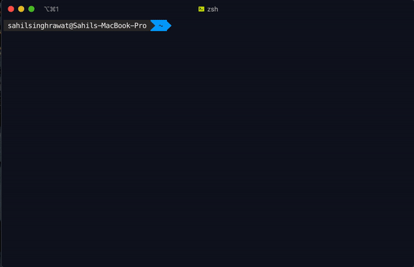

# Hello, folks! 

My name is Sahil Singh Rawat and I'm a Engineering Student, Developer and a Ethical Hacking Enthusiast I'm from India, living in Indore and currently pursuing B.Tech CSE.
I'm a tech enthusiast who loves to learn about new things.
Lets Connect.


[](https://www.linkedin.com/in/sahil-singh-rawat/)
[](https://github.com/sahil-rawat)
[](https://twitter.com/sahil_s_rawat)
[](mailto:sahilsinghrawat1405@gmail.com)

## 🔧 Technologies & Tools


<h2 align="center"> 👨‍💻 Whoami</h2>
<p align="center">

I'm a Computer Science Undergrad. I'm a coder, devloper, hacker. I'm passionate about technology and love to learn about technology. Iam intrested in Cyber Security and looking forward for specialization in it.

<ul style="list-style-type: none;">
<li>
💻 Coding in Javascript and python
</li>
<li>
🔒 I am currently learning about the cybersecurity field, How to secure the Web Servers/Applications, learning about Cryptography and Pentesting.
</li>
<li>
🧑🏻‍💻 Actively Participating in Various Compititons, Hackathons.
</li>
<li>
🖥 Web Devloper
</li>
<li>
📱 App Devloper
</li>
</ul>

</p>

<hr>
<h2 align="center">💳 npm Card</h2>

To learn more you can refer to my npm card which can be used as With npm installed Type
```
npx sahilsinghrawat
```

<hr>
<h2 align="center">📊 GitHub Stats</h2>
<br>

<a href="https://github.com/sahil-rawat/">
  
</a>
<a href="https://github.com/sahil-rawat/">
  
</a>

<hr>
